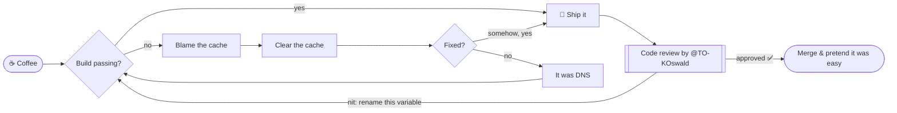

<!--
  ── If you're reading the source: congrats, you found the basement. ──
  Yes, the unicorns used to live here. They've been containerized,
  tagged `legacy:do-not-deploy`, and pushed to a registry far, far away.
  This README is now 100% certified horse-free. 🐴🚫
-->

  

  
  
  
  

> [!WARNING]
> If you came here for the **Coding Ranch™** — it has been permanently decommissioned.
> The unicorns were gracefully drained, the rainbow GIFs rolled back, and all
> horse-related assets migrated to their rightful owner. This is a horse-free zone now.[^1]

## 👋 Who dis

I'm **Nico** — a full-stack developer who spends the day hopping between backend
services, frontend code, and whatever system decided to catch fire that morning.
Strong opinions about clean code, weakly held opinions about tabs vs. spaces
(I let the formatter fight that war for me).

> [!TIP]
> Robots should do the boring stuff. If I do something manually twice, the third
> time is a script.

## 🧰 Toolbox

  

## 🔁 My actual development workflow

This diagram renders live from the source — GitHub speaks Mermaid natively:

## 🤝 Sidekick in code

Still riding shotgun on every pull request: [**@TO-KOswald**](https://github.com/TO-KOswald) —
partner-in-pull-requests, first responder for `git push --force` incidents, and the
reason half my variable names are actually readable.

## 📊 Numbers that look professional

These cards switch with your GitHub theme — dark mode gets dark cards, light mode
gets light ones. Toggle your theme and watch them flip.

  <picture>
    <source media="(prefers-color-scheme: dark)" srcset="https://github-readme-stats.vercel.app/api?username=TO-NMaag&show_icons=true&theme=tokyonight&hide_border=true&bg_color=00000000" />
    
  </picture>

  <picture>
    <source media="(prefers-color-scheme: dark)" srcset="https://github-readme-stats.vercel.app/api/top-langs/?username=TO-NMaag&layout=compact&theme=tokyonight&hide_border=true&bg_color=00000000" />
    
  </picture>

## 🐍 The only animal allowed on this profile

A snake eating my contribution graph, regenerated nightly by a GitHub Action:

  <picture>
    <source media="(prefers-color-scheme: dark)" srcset="https://raw.githubusercontent.com/TO-NMaag/TO-NMaag/output/github-contribution-grid-snake-dark.svg" />
    
  </picture>

## 🧪 Currently poking at

<b>⚙️ Automation</b> — because time bookings won't book themselves

 

Building small tools that remove repetitive work from my day. Current rule of thumb:
if a task survives two manual repetitions, it gets automated on the third.

<b>🧠 Patterns & architecture</b> — design patterns, event-driven everything

 

Digging deeper into design patterns and event-driven architectures. `async`/`await`
is easy; knowing <i>when</i> an event bus turns your system into a haunted house is the hard part.

<b>🕵️ Easter egg</b> — you actually clicked it

 

> [!IMPORTANT]
> You are the kind of person who expands collapsed sections. We need more of you
> in code reviews. <kbd>Ctrl</kbd>+<kbd>Shift</kbd>+<kbd>Respect</kbd>

---

[^1]: No horses were harmed during the refactoring of this README. One unicorn filed a complaint with HR; it was closed as `wontfix`.

